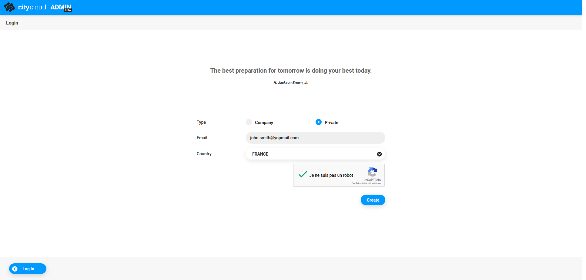

# User manual - cloud deployment

## Vexxhost

### Account creation

before to deploy a hyphe server on vexxhost, you need to create an account.

Go to https://secure.vexxhost.com/billing/register.php and fulfill the form

Then check your mailbox, you will receive an email to validate your account creation.

When it's done, you need to register a billing method.

### Public cloud dashboard

In your Vexxhost account, inside `Public cloud` page, you will find the connexion information for the public cloud :

So just go on the page https://dashboard.vexxhost.net/ and use the login / password found in your account.

#### Find the project name

During the deploy process in hyphe browser, you will be asked to fufill the project name.
To retreive it, you need to got on `Identity > project` in the dashboard.

Like in the screenshot, you should just have one line in the table. You should save somewhere the name (not the ID) of the project.

### Hyphe browser

Now that you Vexxhost is created and working, you can open your hyphe browser.

1. Choose to deploy a new cloud server

2. On this page, a text explain to you the process. You can click on the button to go to the next step.

3. You need to fulfill the needed information for the authentication

4. Make the configuration of your hyphe

You can also check the box at the top, to see the full configuration

5. On the next screen, you will be asked to choose the cloud server you want

You have to select :

- the data-center where you want to deploy the server
- the sizing of the serveur based a pre-defined list from the provider. You can filter the list with the form belloew the select box
- the hard driver size, if you have selected a server sizing without a disk

6. Before to launch the deployment process, the application is asking you to confirm.

7. Now the deployment process is running

Once the server is created & online, you can follow the hyphe installation by checking the logs

At this step, your hyphe server is up and running, and you can use it in your hyphe browser.

## City Cloud

### Account creation

Go to this url to create an account : https://admin.citycloud.com/login

Fulfill the form and validate it.

Then you will receive an email in your mailbox with a validation link.
Click on it, and you should be redirected to this webpage :

### Open Stack Cloud

One your account is created, you need to go https://citycontrolpanel.com with your account.

You have 3 :

- find your domain & project name
- find / create an openstack user
- create a network

#### Find the project

At the creation of your account, city cloud creates a default domain and project, and you will need them in hyphe-browser.
To find them , just go on this page : https://citycontrolpanel.com/openstack#manage_projects

In this example, I have two projects _test Hype_ and _Default Project 38263_.
You should save somewhere the name of the project, because you will need it in hyphe browser.

#### Find the domain and create a user

Now, go on this page : https://citycontrolpanel.com/openstack#openstack_api_access

This page list all the regions of the cloud provider (ie. the datacenters).
And for each region you can find the name of the domaine (here _CCP_Domain_38263_), and you can also a create a user

#### Create a network

Go to this page https://citycontrolpanel.com/openstack#networks , and click on the button _Create Network_

The only thing you need to do, it's to fulfill the name of the network, as for example _hyphe-network_,
and the data center where you want to deploy your hyphe server (in the example _London_).

## Hyphe browser

On Hyphe browser, you just have to follow the classic workflow to create the server.

Citycloud can't dynamically create a server with a public IP, that's why at the end of the process you can't see the server's log and that you will be stuck on this page :

But your server is created !

To correct that, you need to give a public IP to your server :

1. Go to https://citycontrolpanel.com/openstack#list-servers
2. Click on the cog menu on the line of your created server, and select the item _Connect Floating IP_

3. On the popin, just click on the button _Add floating IP_ and wait

4. When it's done, you should see on the line of your server, the public IP addressof your server

Now your hyphe server is ready and you can access it throw your browser.
But if you want to use it with hyphe-browser, you need to change the URL that it has registered .

Just open your hyphe-browser, and in the list of server select the one you have created,
and click on the pencil on the right of the select box.

Here you just have to change the URL with the floating IP your server has.
